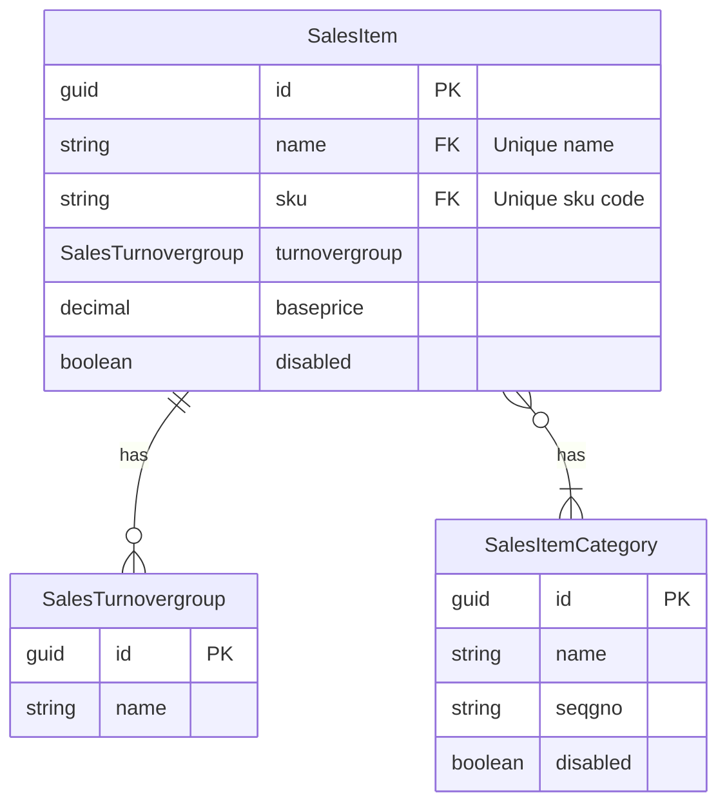

# Sales item
The sales items are the most important data from the cash register. In this first version, we are assuming an MVP cash register in which we only record minimal basic data from the cash register.

## ERD Diagram

