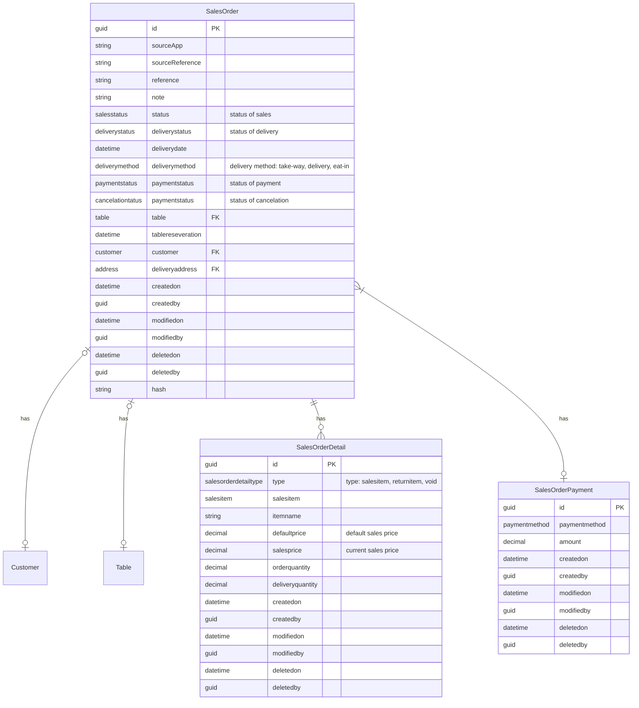

# Sales order erd

```mermaid
erDiagram
    SalesOrder {
        guid id PK
        string sourceApp
        string sourceReference
        string reference
        string note
        salesstatus status "status of sales"
        deliverystatus deliverystatus "status of delivery"
        datetime deliverydate 
        deliverymethod deliverymethod "delivery method: take-way, delivery, eat-in"
        paymentstatus paymentstatus "status of payment"
        cancelationtatus paymentstatus "status of cancelation"
        table table FK
        datetime tablereseveration
        customer customer FK
        address deliveryaddress FK        
        datetime createdon
        guid createdby
        datetime modifiedon
        guid modifiedby
        datetime deletedon
        guid deletedby
        string hash
    }
    SalesOrder |o--o| Customer : has
    SalesOrder |o--o| Table : has
    SalesOrder ||--o{ SalesOrderDetail : has
    SalesOrderDetail {
        guid id PK
        salesorderdetailtype type "type: salesitem, returnitem, void"
        salesitem salesitem
        string itemname
        decimal defaultprice "default sales price"
        decimal salesprice "current sales price"
        decimal orderquantity
        decimal deliveryquantity
        datetime createdon
        guid createdby
        datetime modifiedon
        guid modifiedby
        datetime deletedon
        guid deletedby
    }
    SalesOrder }|--o| SalesOrderPayment : has
    SalesOrderPayment {
        guid id PK 
        paymentmethod paymentmethod
        decimal amount
        datetime createdon
        guid createdby
        datetime modifiedon
        guid modifiedby
        datetime deletedon
        guid deletedby
    }
```
