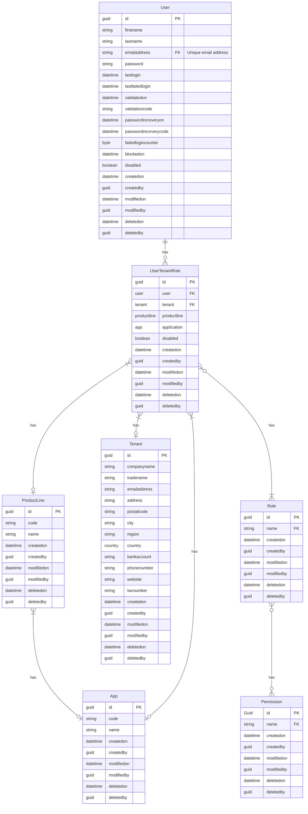

# SAAS ERD DIAGRAM

```mermaid
erDiagram
    User {
        guid id PK 
        string firstname
        string lastname        
        string emailaddress FK "Unique email address"
        string password
        datetime lastlogin
        datetime lastfailedlogin
        datetime validatedon
        string validationcode
        datetime passwordrecoveryon
        datetime passwordrecoverycode
        byte failedlogincounter
        datetime blockedon
        boolean disabled
        datetime createdon
        guid createdby
        datetime modifiedon
        guid modifiedby
        datetime deletedon
        guid deletedby
    }
    User ||--o{ UserTenantRole : has
    UserTenantRole {
        guid id PK 
        user user FK
        tenant tenant FK
        productline productline
        app application
        boolean disabled
        datetime createdon
        guid createdby
        datetime modifiedon
        guid modifiedby
        datetime deletedon
        guid deletedby
    }
    UserTenantRole }|--o| ProductLine : has
    ProductLine {
        guid id PK 
        string code
        string name
        datetime createdon
        guid createdby
        datetime modifiedon
        guid modifiedby
        datetime deletedon
        guid deletedby
    }
    ProductLine }|--o| App : has
    App {
        guid id PK 
        string code
        string name
        datetime createdon
        guid createdby
        datetime modifiedon
        guid modifiedby
        datetime deletedon
        guid deletedby
    }
    UserTenantRole }|--o| App : has
    UserTenantRole }|--o| Tenant : has
    Tenant {
        guid id PK 
        string companyname
        string tradename
        string emailaddress
        string address
        string postalcode
        string city
        string region
        country country
        string bankaccount
        string phonenumber
        string website
        string taxnumber
        datetime createdon
        guid createdby
        datetime modifiedon
        guid modifiedby
        datetime deletedon
        guid deletedby
    }
    UserTenantRole }o--|{ Role :has
    Role {
        guid id PK
        string name FK
        datetime createdon
        guid createdby
        datetime modifiedon
        guid modifiedby
        datetime deletedon
        guid deletedby
    }
    Role }o--o{ Permission : has
    Permission {
        Guid id PK
        string name FK
        datetime createdon
        guid createdby
        datetime modifiedon
        guid modifiedby
        datetime deletedon
        guid deletedby
    }

```
