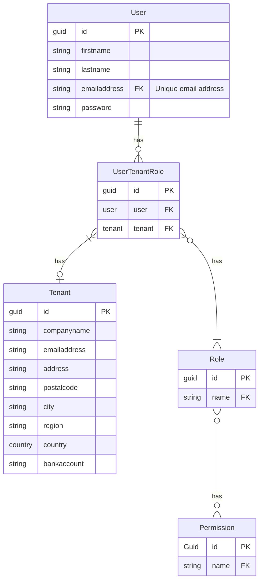

# Authentication

To access the api the user must be login into the application.

## Register

## Login

## Logoff

```mermaid
erDiagram
    User {
        guid id PK 
        string firstname
        string lastname        
        string emailaddress FK "Unique email address"
        string password
    }
    User ||--o{ UserTenantRole : has
    UserTenantRole {
        guid id PK 
        user user FK
        tenant tenant FK
    }
    UserTenantRole }|--o| Tenant : has
    Tenant {
        guid id PK 
        string companyname
        string emailaddress
        string address
        string postalcode
        string city
        string region
        country country
        string bankaccount
    }
    UserTenantRole }o--|{ Role :has
    Role {
        guid id PK
        string name FK
    }
    Role }o--o{ Permission : has
    Permission {
        Guid id PK
        string name FK
    }

```

