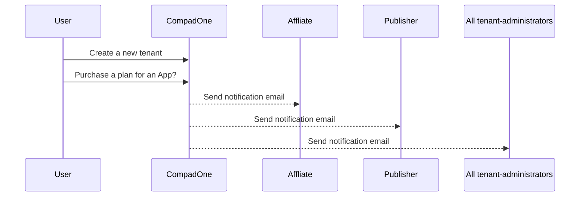
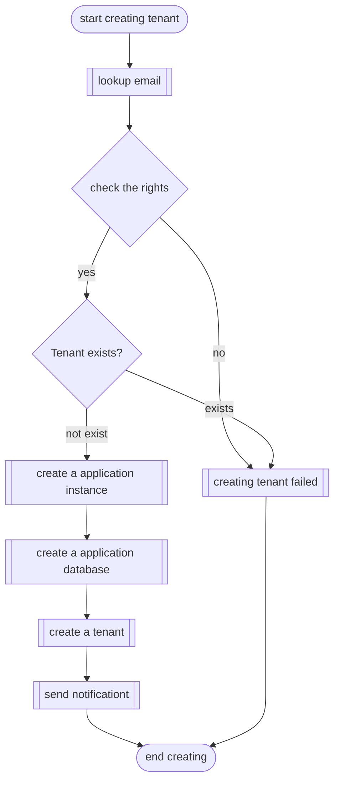
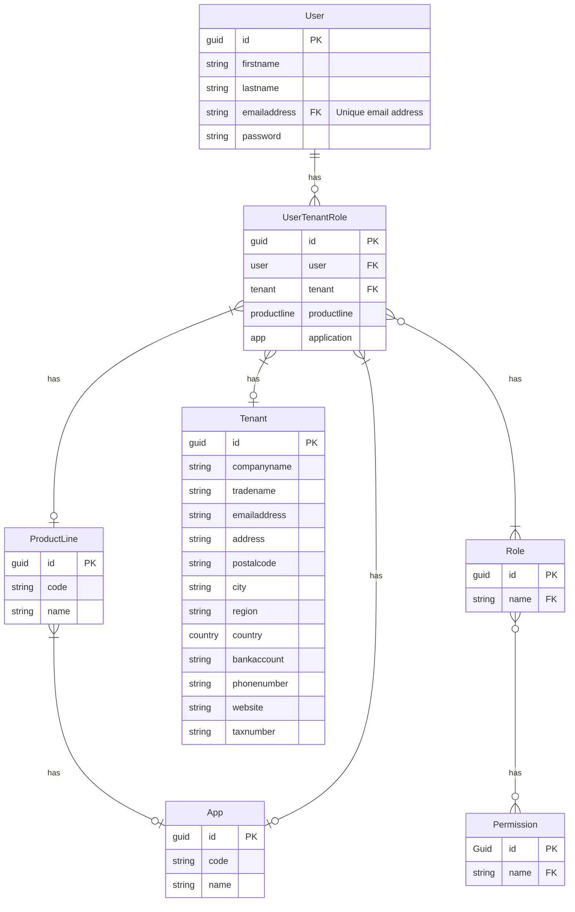

![][~concept]

[~concept]: https://img.shields.io/badge/-concept-ff0000.svg

# Create tenant

After the user had register an `UserAccount` he/she can create one or more tenants. Only user with the role `tenant administrator` can create new tenants and **external** users who are 
invited by another user can create a new tenant for his own business

**Creating tenant process**

## Screen design

## Tenant creating process

Who can create an tenant?
- **external** users who where invited by another user, they can create a tenant for there own business
- users with an user role 'tenant administrators'

**Process**

> [!NOTE]  
> All administrative and financial processing for new tenants, including invoicing of subscriptions for these tenants and payments, is handled by CompadOne. We will use CompadOne for the invoicing itself.

## ERD Diagram

## 🔗 Related information API
- [create tenant](api/post.md)
- [update tenant](api/put.md)
- [delete tenant](api/delete.md)
- [switch tenant](api/switch.md)
- [get tenant](api/get.md)
- [get tenant](api/get-list.md)

## 🔗 Related information
- [general](index.md)
- [switch tenant](switch-tenant.md)

