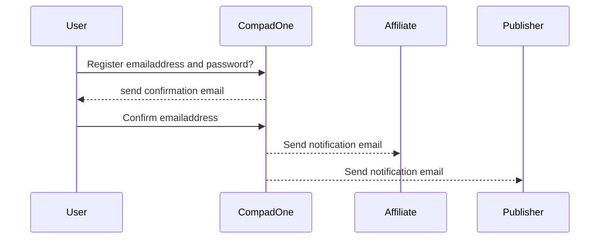
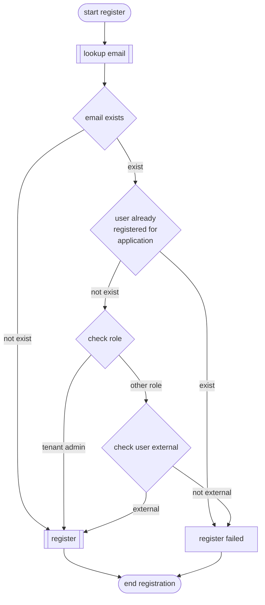

# Register user
When an User wants access to a CompadOne application or to the CompadOne portal, he/she must have an account. An user get an account to CompadOne by create an Account or when he/she got invated by an registered user. An UserAccount have access to a Tenant

## Sequence diagram



> [!IMPORTANT]  
> The registration process should be as simple as possible. Therefore, it is not necessary to confirm the email address ? immediately, but within 24 hours. Every time the user attempts to log in with an email address that has not yet been confirmed, a confirmation email will be sent.

## Screen design


## API Endpoints

**URL** : `/api/_version_/authentication/register`

**Method** : `POST`

**Auth required** : NO

**Permissions required** : None

**Data constraints**

```json
{
    "productlineCode": "[valid productline code - (1 to 100 chars)]",
    "applicationCode": "[valid productline code - (1 to 100 chars)]"
    "username": "[valid emailaddress - (1 to 300 chars)]",
    "password": "[password (1 to 100 chars)]",
    "firstName": "[1 to 100 chars]",
    "lastName": "[1 to 100 chars]"
    "phoneNumber": "[valid international phonenumber (1 to 100 chars])",
    "affiliate": "[1 to 100 chars]"
}
```


**Data examples**

```json
{
    "productlineCode": "CompadOne",
    "applicationCode": "pos",
    "username": "esmeijer@compad.nl",
    "password": "12345",
    "firstName": "Carol",
    "lastName": "Esmeijer",
    "phoneNumber": "+31(0)743200200",
    "phoneNumber": "00000-00000-00000-00000",
}
```
**Process**



### Success Responses

**Condition** :  If everything is OK and an Account didn't exist for this User.

**Code** : `201 CREATED`

**Content example** : Response will reflect back the created user information. A
User with `id` of '00000-00000-00000-00000' sets their name, passing `token` header of :

```json
{
    "user" : {
        "id": "0000-0000-0000-0000",
        "emailAddress": "esemeijer@compad.nl",
        "firstName": "Carol",
        "lastName": "Esmeijer"        
    },
    "token" : "93144b288eb1fdccbe46d6fc0f241a51766ecd3d":
}
```
#### Note

* After the account has been created, the account must be activated within 24 hour
* To activate an account, the user receives a validation email. By clicking on the activation link in the validation email, the account is activated
* Created accounts are external accounts and can fully manage new tenants and already created tenants independently
