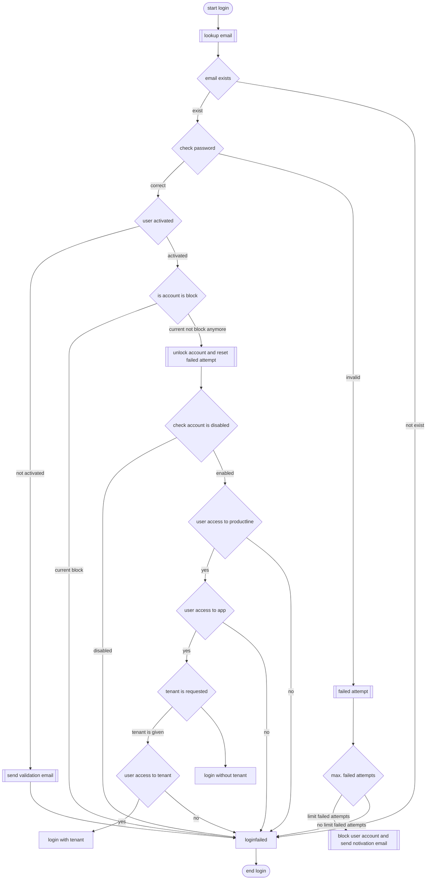

# Login User Account

CompadOne uses central user and tenant management, allowing users to access different applications with a single user account. An user can login to a specific tenant or a specific application. 
During the login process, the user account is checked for the following:

- user activated
- user not disabled
- user not blocked due to too many incorrect login attempts
- user access to requested tenant
- user access to requested application

## Screen design

## Registration process

**Process**

## 🔗 Related information
- [login](login.md)
- [logout](logout.md)
- [forgot password](password-recovery-request.md)
- [email validate](user-confirmed.md)
- [inovate](user-inovate.md)

