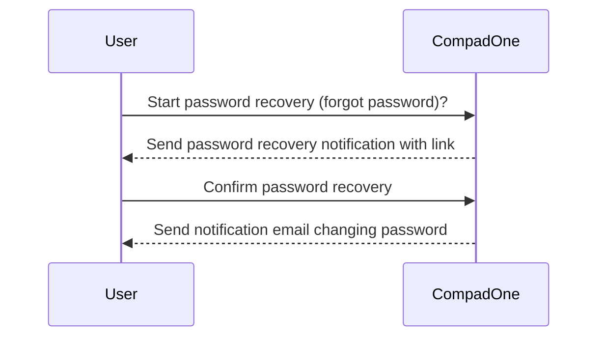
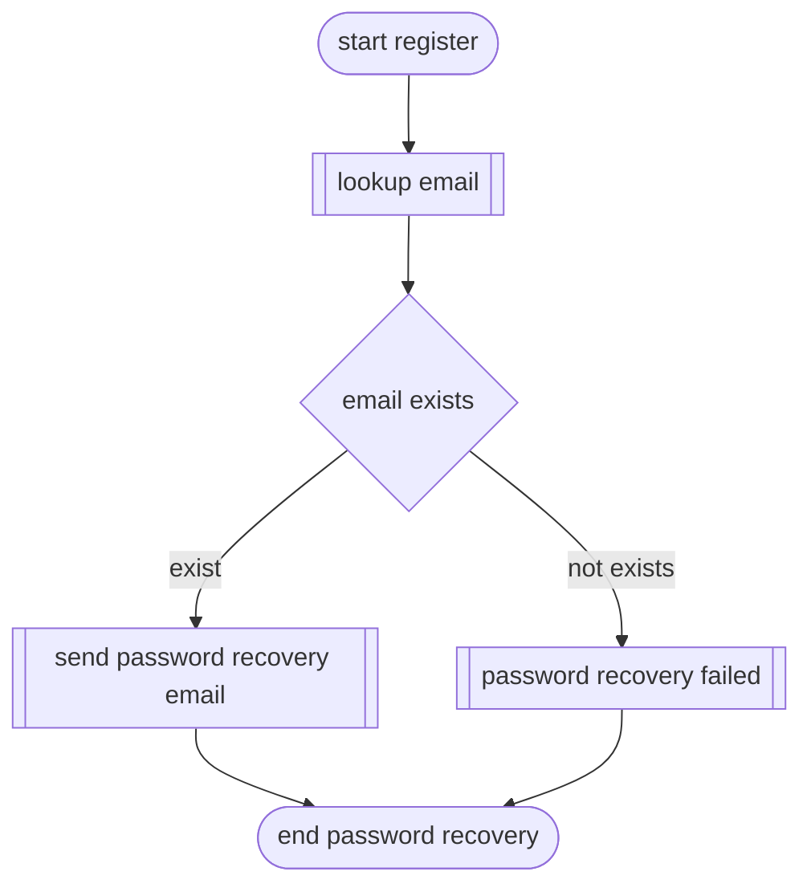
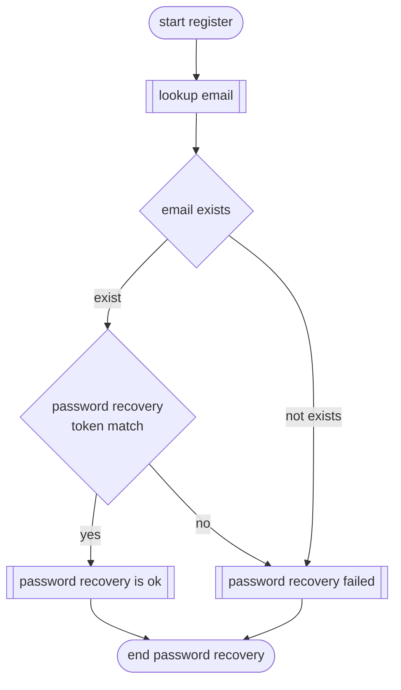
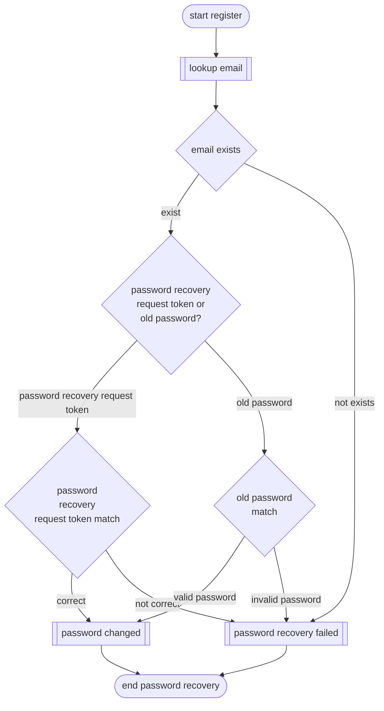

# Register User Account

Users have one single user account forall the CompadOne applications. When the user forgot his password, he/she can start a password recovery procedure, by press on the 'forgotten password'.

**Validation process**

## Screen design

## Password recovery process

The password recovery procedure has three step. The first step generate an unique `password recovery request token' and send it by email to the user. In the second step the user can enter the request token or press on the link in the email.
When the combination 'username' and 'password recovery request token' match, the user can set an new password. There are the API available for password recovery.

- password-recovery-request
- password-recovery
- password

**Fase 1 - Password recovery request**

**Fase 2 - Password recovery check**

**Fase 3 - Change password**

## 🔗 Related information API
- [password-recovery request](/api/password-recovery-request.md)
- [password-recovery](api/password-recovery.md)
- [change password](/api/password.md)

  ## 🔗 Related information
- [login](login.md)
- [logout](logout.md)
- [register](register.md)
- [invite](user-invite.md)

