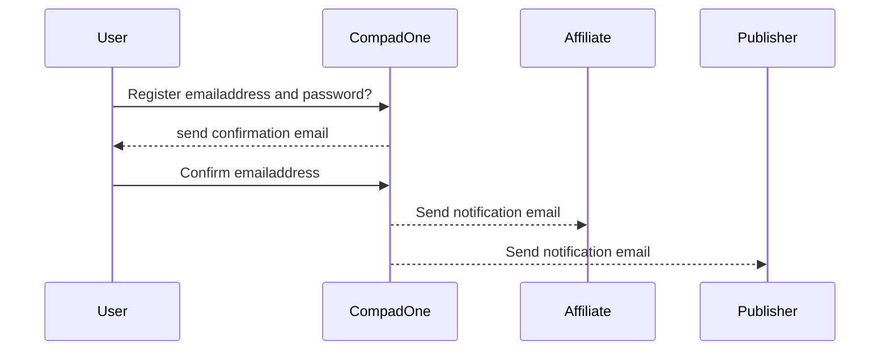
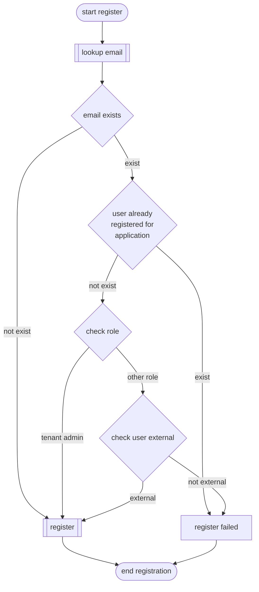

# Register User Account

CompadOne consists of various applications that together offer a total solution. These include a web-based management portal for managing master data such as customers, 
articles, and the like. But also applications such as mobile cash register, desktop point of sale, or a reporting app. To give users access to this total solution, central user management is desirable.

A company can use CompadOne by having the business owner register via one of the applications with a unique email address. If the email address does not exist,
an account is created for this user. This user is automatically assigned one or more roles, namely the role of ‘tenant administrator’ ,‘tenant administrator’ and ‘application administrator’.

After creating the account, the email address must be validated within 24 hours. The user will receive a validation email with a confirmation link. Every time the user 
logs in to one of the applications, the user will receive a validation email as long as their email address has not yet been validated. Email addresses that are not activated within 24 hours will be blocked. 
With each login attempt, the user will receive a confirmation email containing a confirmation link at their email address.

**Validation process**

> [!NOTE]  
> In the interest of a quick and easy registration process, we believe it is important that users can start using their accounts immediately without having to validate their email
> addresses first.  That is why users can use their new accounts for 24 hours without validating their email addresses.

When a user with the role of ‘tenant administrator’ logs in for the first time and does not yet have any linked companies/organizations (tenants), 
they have the option to create a tenant. The user is automatically assigned the role of ‘tenant owner’ for this tenant.  If the entrepreneur has multiple companies, 
they can create a tenant for each company here. 

A user with the role of ‘tenant administrator’ or ‘tenant owner’ can invite other internal users (colleagues) or external users to use one or more applications for one 
or more tenants. A user can be invited by the ‘tenant administrator’ or ‘tenant owner’ by entering the name and email address of the new user and whether it is an **internal** or **external** user. 
The user will then receive an invitation email containing a confirmation link. 

Only external users or internal user with the role ‘tenant administrator’ can create new tenants. 

> [!NOTE]  
> **External** users must also be able to create new tenants. The reason for this is that external users (partners, consultants, or customers) may also have their own businesses for which CompadOne could be a good solution.

## Screen design

## Registration process

**Process**

## 🔗 Related information
- [login](login.md)
- [logout](logout.md)
- [forgot password](password-recovery-request.md)
- [email validate](user-confirmed.md)
- [inovate](user-inovate.md)

